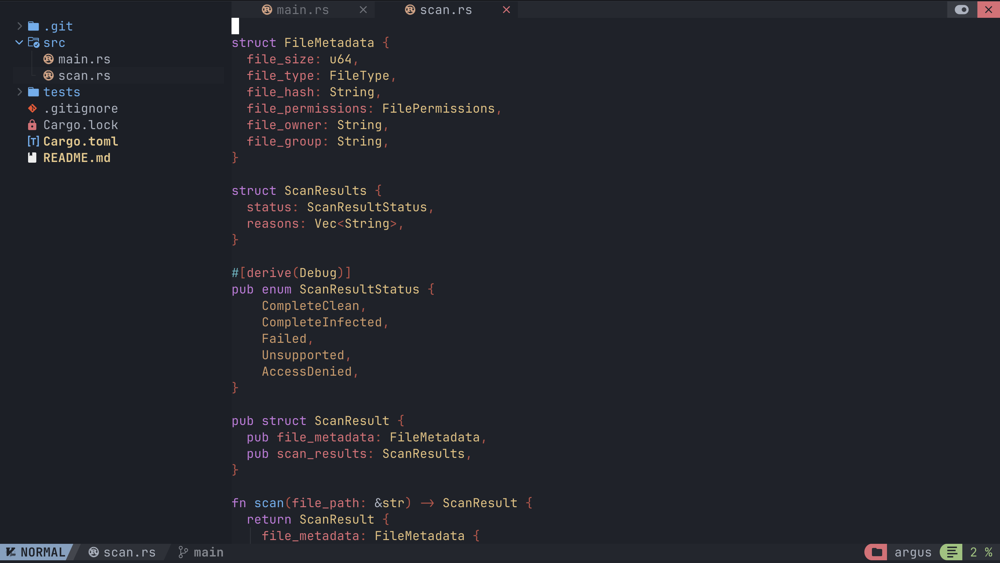
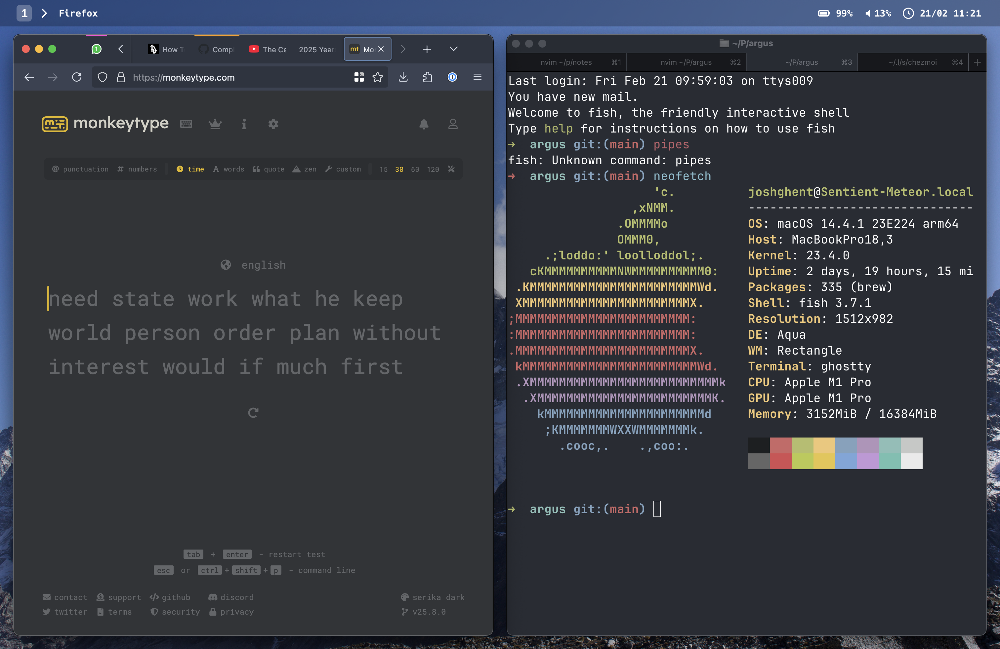

# 🏡 Cross-Platform Dotfiles

> My personal dotfiles and machine setup scripts managed with Chezmoi - supports both macOS and Fedora Linux!

## Screenshots





## 🚀 Features

- **Cross-Platform**: Seamlessly works on both macOS and Fedora Linux
- **Package Management**: Automatic package installation via Homebrew (macOS) and DNF/Flatpak (Fedora)
- **Modern Tools**: Fish shell, Neovim, Git Delta, and more
- **Window Management**:
  - macOS: Aerospace + Sketchybar
  - Fedora: GNOME with extensions + Ulauncher
- **Consistent Experience**: Shared configurations where possible, platform-specific where necessary

## 📥 Installation

### Prerequisites

Install Chezmoi:

```bash
sh -c "$(curl -fsLS get.chezmoi.io)" -- -b "$HOME/.local/bin"
```

### Clone and Apply

```bash
chezmoi init git@github.com:joshghent/dotfiles.git
chezmoi apply
```

### Post-Installation

#### macOS
The installation script will automatically:
- Install Homebrew packages and casks
- Configure Aerospace window manager
- Setup Sketchybar

#### Fedora
The installation script will automatically:
- Enable RPM Fusion and Flathub repositories
- Install DNF packages and Flatpak applications
- Install and configure GNOME extensions:
  - **Pop Shell**: Automatic tiling window management
  - **Dash to Dock**: macOS-like dock at the bottom
  - **AppIndicator**: System tray support
  - **Blur My Shell**: Beautiful blur effects
  - **Caffeine**: Disable screen timeout when needed
- Setup Ulauncher application launcher
- Configure macOS-like keyboard shortcuts

**Post-setup**: Log out and back in for extensions to activate

## 🛠️ Platform-Specific Configurations

### macOS
- **Window Manager**: Aerospace (tiling window manager)
- **Status Bar**: Sketchybar
- **Package Manager**: Homebrew
- **Container Runtime**: Colima

### Fedora
- **Desktop Environment**: GNOME with Pop Shell tiling
- **Launcher**: Ulauncher (Alt+Space)
- **Screenshot Tool**: Flameshot
- **Extensions**: Pop Shell, Dash to Dock, AppIndicator, Blur My Shell, Caffeine
- **Package Managers**: DNF + Flatpak
- **Container Runtime**: Podman

### Keyboard Shortcuts (Fedora)
- `Super + 1-5`: Switch to workspace 1-5
- `Super + Shift + 1-5`: Move window to workspace 1-5
- `Super + Return`: Open Kitty terminal
- `Super + Y`: Toggle Pop Shell tiling mode
- `Alt + Space`: Open Ulauncher
- `Super + Direction Keys`: Navigate tiled windows

## 📦 Key Tools Included

### Common (Both Platforms)
- **Shell**: Fish with custom functions and aliases
- **Editor**: Neovim with modern plugins
- **Git**: Enhanced with Delta diff viewer
- **Terminal**: Kitty
- **File Navigation**: Yazi, Ranger
- **CLI Tools**: ripgrep, bat, fzf, lazygit, lazydocker

### Development Tools
- Version managers (mise)
- Docker/Podman
- Various language toolchains (Go, Rust, Python, Node.js)

## 🔧 Customization

The dotfiles use Chezmoi templates for cross-platform compatibility. Key template files:
- `dot_config/fish/config.fish.tmpl` - Fish shell configuration
- `dot_gitconfig.tmpl` - Git configuration
- `run_once_before_install-packages-*.sh.tmpl` - Package installation scripts

## 📝 Notes

- First-time setup may take 10-30 minutes depending on your internet connection
- On Fedora, extensions are installed and configured automatically
- After first login, you may want to configure Ulauncher (set hotkey to Alt+Space)
- Pop Shell tiling can be toggled on/off with Super+Y
- All GNOME extensions can be managed via the Extensions app
